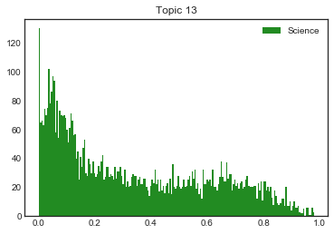
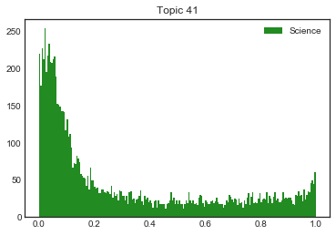
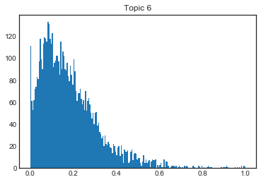
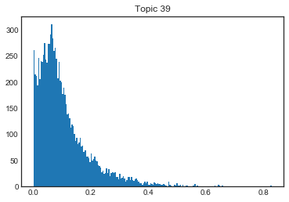
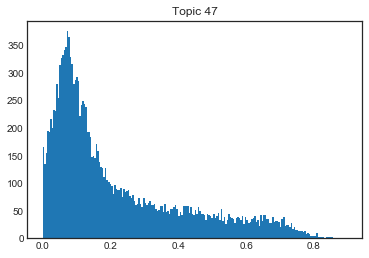

# Load Data
This data is the raw output from mallet-LDA. Each row is a volume, and the columns are topics, the cells are the corresponding wieght of a topic in a volume. 


```python
import os
import pandas as pd
volume_topics = '/Users/RustyOllie/Google Drive/HTRC/Genre Analysis/20191007_topics.txt'

data = pd.read_csv(volume_topics, sep = '\t', lineterminator = '\n', header=None)
data.drop(columns = 0, inplace = True)
data[1] = [string[string.rfind('/UK_data/')+9:-4] for string in data[1]]
data.columns = ['HTID'] + [i for i in range(1,61)]
print("Dimensions: " + str(data.shape))
data.head()
```

    Dimensions: (166779, 61)


<div>
<style scoped>
    .dataframe tbody tr th:only-of-type {
        vertical-align: middle;
    }

    .dataframe tbody tr th {
        vertical-align: top;
    }

    .dataframe thead th {
        text-align: right;
    }
</style>
<table border="1" class="dataframe">
  <thead>
    <tr style="text-align: right;">
      <th></th>
      <th>HTID</th>
      <th>1</th>
      <th>2</th>
      <th>3</th>
      <th>4</th>
      <th>5</th>
      <th>6</th>
      <th>7</th>
      <th>8</th>
      <th>9</th>
      <th>...</th>
      <th>51</th>
      <th>52</th>
      <th>53</th>
      <th>54</th>
      <th>55</th>
      <th>56</th>
      <th>57</th>
      <th>58</th>
      <th>59</th>
      <th>60</th>
    </tr>
  </thead>
  <tbody>
    <tr>
      <th>0</th>
      <td>uc1.b5568131</td>
      <td>0.335310</td>
      <td>0.000703</td>
      <td>0.000039</td>
      <td>0.070415</td>
      <td>0.094437</td>
      <td>1.841183e-05</td>
      <td>0.001295</td>
      <td>0.000024</td>
      <td>0.000154</td>
      <td>...</td>
      <td>0.000062</td>
      <td>0.000063</td>
      <td>0.004128</td>
      <td>1.217153e-05</td>
      <td>0.021920</td>
      <td>5.930538e-03</td>
      <td>8.631037e-06</td>
      <td>0.000059</td>
      <td>0.000046</td>
      <td>0.035256</td>
    </tr>
    <tr>
      <th>1</th>
      <td>uc1.$b135547</td>
      <td>0.002840</td>
      <td>0.001595</td>
      <td>0.000032</td>
      <td>0.001070</td>
      <td>0.071715</td>
      <td>1.507521e-05</td>
      <td>0.000041</td>
      <td>0.000020</td>
      <td>0.067670</td>
      <td>...</td>
      <td>0.003109</td>
      <td>0.037010</td>
      <td>0.012810</td>
      <td>9.965785e-06</td>
      <td>0.026869</td>
      <td>3.071620e-03</td>
      <td>1.020237e-02</td>
      <td>0.001323</td>
      <td>0.000038</td>
      <td>0.000065</td>
    </tr>
    <tr>
      <th>2</th>
      <td>hvd.32044106314859</td>
      <td>0.000017</td>
      <td>0.000032</td>
      <td>0.000015</td>
      <td>0.000024</td>
      <td>0.000045</td>
      <td>7.224896e-06</td>
      <td>0.000019</td>
      <td>0.000009</td>
      <td>0.000060</td>
      <td>...</td>
      <td>0.000024</td>
      <td>0.000025</td>
      <td>0.000032</td>
      <td>4.776170e-06</td>
      <td>0.000051</td>
      <td>6.244357e-06</td>
      <td>2.812933e-03</td>
      <td>0.000023</td>
      <td>0.000140</td>
      <td>0.000031</td>
    </tr>
    <tr>
      <th>3</th>
      <td>uc1.$b29323</td>
      <td>0.000014</td>
      <td>0.000003</td>
      <td>0.003943</td>
      <td>0.013454</td>
      <td>0.000005</td>
      <td>3.564930e-02</td>
      <td>0.000039</td>
      <td>0.000075</td>
      <td>0.000006</td>
      <td>...</td>
      <td>0.000076</td>
      <td>0.006445</td>
      <td>0.000028</td>
      <td>4.816316e-07</td>
      <td>0.000005</td>
      <td>6.296845e-07</td>
      <td>3.415332e-07</td>
      <td>0.000002</td>
      <td>0.068478</td>
      <td>0.023605</td>
    </tr>
    <tr>
      <th>4</th>
      <td>mdp.39015076816662</td>
      <td>0.000002</td>
      <td>0.000004</td>
      <td>0.000941</td>
      <td>0.000003</td>
      <td>0.000006</td>
      <td>9.914233e-07</td>
      <td>0.000003</td>
      <td>0.020569</td>
      <td>0.033567</td>
      <td>...</td>
      <td>0.000003</td>
      <td>0.000020</td>
      <td>0.000004</td>
      <td>6.554013e-07</td>
      <td>0.000007</td>
      <td>6.790642e-05</td>
      <td>4.647562e-07</td>
      <td>0.000020</td>
      <td>0.000002</td>
      <td>0.000004</td>
    </tr>
  </tbody>
</table>
<p>5 rows × 61 columns</p>
</div>


### We extract from this data the top 5 topics for each volume, and the corresponding weights


```python
import numpy as np

s = np.sort(data[data.columns[1:61]].values)[:,-5:]
s = [np.flip(l) for l in s]

d = [x+1 for x in[np.flip(l[-5:]) for l in np.array(data[data.columns[1:61]]).argsort(axis=1)]]
final = pd.DataFrame(pd.concat([data['HTID'], pd.DataFrame(d), pd.DataFrame(s)], axis=1))
# final.columns(['HTID', 't_1', 't_2', 't_3', 't_4', 't_5', 'd_1', 'd_2', 'd_3', 'd_4', 'd_5'])
final.columns = ['HTID', 'topic_1', 'topic_2', 'topic_3', 'topic_4', 'topic_5', 'weight_1', 'weight_2', 'weight_3', 'weight_4', 'weight_5']
final.head()
```


<div>
<style scoped>
    .dataframe tbody tr th:only-of-type {
        vertical-align: middle;
    }

    .dataframe tbody tr th {
        vertical-align: top;
    }

    .dataframe thead th {
        text-align: right;
    }
</style>
<table border="1" class="dataframe">
  <thead>
    <tr style="text-align: right;">
      <th></th>
      <th>HTID</th>
      <th>topic_1</th>
      <th>topic_2</th>
      <th>topic_3</th>
      <th>topic_4</th>
      <th>topic_5</th>
      <th>weight_1</th>
      <th>weight_2</th>
      <th>weight_3</th>
      <th>weight_4</th>
      <th>weight_5</th>
    </tr>
  </thead>
  <tbody>
    <tr>
      <th>0</th>
      <td>uc1.b5568131</td>
      <td>1</td>
      <td>35</td>
      <td>5</td>
      <td>26</td>
      <td>4</td>
      <td>0.335310</td>
      <td>0.234172</td>
      <td>0.094437</td>
      <td>0.073561</td>
      <td>0.070415</td>
    </tr>
    <tr>
      <th>1</th>
      <td>uc1.$b135547</td>
      <td>17</td>
      <td>33</td>
      <td>5</td>
      <td>9</td>
      <td>12</td>
      <td>0.347946</td>
      <td>0.180041</td>
      <td>0.071715</td>
      <td>0.067670</td>
      <td>0.055893</td>
    </tr>
    <tr>
      <th>2</th>
      <td>hvd.32044106314859</td>
      <td>48</td>
      <td>44</td>
      <td>57</td>
      <td>59</td>
      <td>21</td>
      <td>0.880612</td>
      <td>0.115078</td>
      <td>0.002813</td>
      <td>0.000140</td>
      <td>0.000139</td>
    </tr>
    <tr>
      <th>3</th>
      <td>uc1.$b29323</td>
      <td>38</td>
      <td>22</td>
      <td>34</td>
      <td>27</td>
      <td>59</td>
      <td>0.402720</td>
      <td>0.154164</td>
      <td>0.110558</td>
      <td>0.090516</td>
      <td>0.068478</td>
    </tr>
    <tr>
      <th>4</th>
      <td>mdp.39015076816662</td>
      <td>13</td>
      <td>28</td>
      <td>9</td>
      <td>8</td>
      <td>3</td>
      <td>0.809524</td>
      <td>0.134050</td>
      <td>0.033567</td>
      <td>0.020569</td>
      <td>0.000941</td>
    </tr>
  </tbody>
</table>
</div>


### Breadth and Concentration
Define topic breadth as **given a topic, the number of books with that topic in its top 5 topics**

Define topic concentration as **given a topic, the average concentration across all volumes with that topic in the top 5**


```python
from math import sqrt
from statistics import mean, stdev
# import statistics

def find_breadth(row): # searches the final df for volumes with a topic in the top 5, and returns the number of books
    a = [row[0]]       # satisfying that condition
    return(final.loc[final['topic_1'].isin(a) | final['topic_2'].isin(a) | final['topic_3'].isin(a) | final['topic_4'].isin(a)
                     | final['topic_5'].isin(a)].shape[0]) 

def find_concentration(row):  
    a = row[0]
    wh = np.where(final == a)
    l = list(zip(wh[0], wh[1]))
    return(mean([final.iloc[(i_1, i_2 + 5)] for (i_1, i_2) in l]))

def find_concentration_stdev(row):  
    a = row[0]
    wh = np.where(final == a)
    l = list(zip(wh[0], wh[1]))
    return(stdev([final.iloc[(i_1, i_2 + 5)] for (i_1, i_2) in l]))

bc = pd.DataFrame(data.columns[1:61], columns = ['Topic'])
bc['Breadth'] = bc.apply(find_breadth, axis=1)
bc['Concentration_avg'] = bc.apply(find_concentration, axis=1)
bc['Concentration_stdev'] = bc.apply(find_concentration_stdev, axis=1)
bc
```


<div>
<style scoped>
    .dataframe tbody tr th:only-of-type {
        vertical-align: middle;
    }

    .dataframe tbody tr th {
        vertical-align: top;
    }

    .dataframe thead th {
        text-align: right;
    }
</style>
<table border="1" class="dataframe">
  <thead>
    <tr style="text-align: right;">
      <th></th>
      <th>Topic</th>
      <th>Breadth</th>
      <th>Concentration_avg</th>
      <th>Concentration_stdev</th>
    </tr>
  </thead>
  <tbody>
    <tr>
      <th>0</th>
      <td>1</td>
      <td>10443</td>
      <td>0.236533</td>
      <td>0.201896</td>
    </tr>
    <tr>
      <th>1</th>
      <td>2</td>
      <td>17673</td>
      <td>0.169171</td>
      <td>0.146765</td>
    </tr>
    <tr>
      <th>2</th>
      <td>3</td>
      <td>6467</td>
      <td>0.148098</td>
      <td>0.116450</td>
    </tr>
    <tr>
      <th>3</th>
      <td>4</td>
      <td>15590</td>
      <td>0.185277</td>
      <td>0.144720</td>
    </tr>
    <tr>
      <th>4</th>
      <td>5</td>
      <td>40343</td>
      <td>0.195084</td>
      <td>0.171943</td>
    </tr>
    <tr>
      <th>5</th>
      <td>6</td>
      <td>6122</td>
      <td>0.183508</td>
      <td>0.138208</td>
    </tr>
    <tr>
      <th>6</th>
      <td>7</td>
      <td>11959</td>
      <td>0.254984</td>
      <td>0.246053</td>
    </tr>
    <tr>
      <th>7</th>
      <td>8</td>
      <td>6615</td>
      <td>0.225676</td>
      <td>0.250952</td>
    </tr>
    <tr>
      <th>8</th>
      <td>9</td>
      <td>48740</td>
      <td>0.092822</td>
      <td>0.056472</td>
    </tr>
    <tr>
      <th>9</th>
      <td>10</td>
      <td>4090</td>
      <td>0.209776</td>
      <td>0.257447</td>
    </tr>
    <tr>
      <th>10</th>
      <td>11</td>
      <td>9451</td>
      <td>0.212534</td>
      <td>0.202818</td>
    </tr>
    <tr>
      <th>11</th>
      <td>12</td>
      <td>28112</td>
      <td>0.214284</td>
      <td>0.189618</td>
    </tr>
    <tr>
      <th>12</th>
      <td>13</td>
      <td>5788</td>
      <td>0.335072</td>
      <td>0.269031</td>
    </tr>
    <tr>
      <th>13</th>
      <td>14</td>
      <td>8364</td>
      <td>0.112394</td>
      <td>0.154808</td>
    </tr>
    <tr>
      <th>14</th>
      <td>15</td>
      <td>5957</td>
      <td>0.161058</td>
      <td>0.149948</td>
    </tr>
    <tr>
      <th>15</th>
      <td>16</td>
      <td>5520</td>
      <td>0.145033</td>
      <td>0.156663</td>
    </tr>
    <tr>
      <th>16</th>
      <td>17</td>
      <td>8639</td>
      <td>0.179775</td>
      <td>0.177363</td>
    </tr>
    <tr>
      <th>17</th>
      <td>18</td>
      <td>6805</td>
      <td>0.354579</td>
      <td>0.334526</td>
    </tr>
    <tr>
      <th>18</th>
      <td>19</td>
      <td>9431</td>
      <td>0.118885</td>
      <td>0.140412</td>
    </tr>
    <tr>
      <th>19</th>
      <td>20</td>
      <td>8780</td>
      <td>0.186165</td>
      <td>0.204512</td>
    </tr>
    <tr>
      <th>20</th>
      <td>21</td>
      <td>9139</td>
      <td>0.140372</td>
      <td>0.116284</td>
    </tr>
    <tr>
      <th>21</th>
      <td>22</td>
      <td>18664</td>
      <td>0.142631</td>
      <td>0.112669</td>
    </tr>
    <tr>
      <th>22</th>
      <td>23</td>
      <td>8324</td>
      <td>0.165553</td>
      <td>0.152348</td>
    </tr>
    <tr>
      <th>23</th>
      <td>24</td>
      <td>5475</td>
      <td>0.287569</td>
      <td>0.272209</td>
    </tr>
    <tr>
      <th>24</th>
      <td>25</td>
      <td>5639</td>
      <td>0.116431</td>
      <td>0.163392</td>
    </tr>
    <tr>
      <th>25</th>
      <td>26</td>
      <td>24395</td>
      <td>0.172095</td>
      <td>0.147053</td>
    </tr>
    <tr>
      <th>26</th>
      <td>27</td>
      <td>15338</td>
      <td>0.133128</td>
      <td>0.104932</td>
    </tr>
    <tr>
      <th>27</th>
      <td>28</td>
      <td>5426</td>
      <td>0.267129</td>
      <td>0.255505</td>
    </tr>
    <tr>
      <th>28</th>
      <td>29</td>
      <td>8138</td>
      <td>0.153778</td>
      <td>0.158614</td>
    </tr>
    <tr>
      <th>29</th>
      <td>30</td>
      <td>8327</td>
      <td>0.218780</td>
      <td>0.216908</td>
    </tr>
    <tr>
      <th>30</th>
      <td>31</td>
      <td>9072</td>
      <td>0.209087</td>
      <td>0.194721</td>
    </tr>
    <tr>
      <th>31</th>
      <td>32</td>
      <td>3780</td>
      <td>0.201312</td>
      <td>0.247216</td>
    </tr>
    <tr>
      <th>32</th>
      <td>33</td>
      <td>55858</td>
      <td>0.130269</td>
      <td>0.082912</td>
    </tr>
    <tr>
      <th>33</th>
      <td>34</td>
      <td>21214</td>
      <td>0.180561</td>
      <td>0.136674</td>
    </tr>
    <tr>
      <th>34</th>
      <td>35</td>
      <td>23876</td>
      <td>0.270209</td>
      <td>0.221492</td>
    </tr>
    <tr>
      <th>35</th>
      <td>36</td>
      <td>11409</td>
      <td>0.180300</td>
      <td>0.168808</td>
    </tr>
    <tr>
      <th>36</th>
      <td>37</td>
      <td>12312</td>
      <td>0.150665</td>
      <td>0.120852</td>
    </tr>
    <tr>
      <th>37</th>
      <td>38</td>
      <td>31248</td>
      <td>0.107008</td>
      <td>0.069264</td>
    </tr>
    <tr>
      <th>38</th>
      <td>39</td>
      <td>9661</td>
      <td>0.105848</td>
      <td>0.094550</td>
    </tr>
    <tr>
      <th>39</th>
      <td>40</td>
      <td>24501</td>
      <td>0.112722</td>
      <td>0.077669</td>
    </tr>
    <tr>
      <th>40</th>
      <td>41</td>
      <td>9177</td>
      <td>0.301363</td>
      <td>0.312382</td>
    </tr>
    <tr>
      <th>41</th>
      <td>42</td>
      <td>6704</td>
      <td>0.188911</td>
      <td>0.143742</td>
    </tr>
    <tr>
      <th>42</th>
      <td>43</td>
      <td>17809</td>
      <td>0.126711</td>
      <td>0.114542</td>
    </tr>
    <tr>
      <th>43</th>
      <td>44</td>
      <td>3397</td>
      <td>0.273009</td>
      <td>0.270933</td>
    </tr>
    <tr>
      <th>44</th>
      <td>45</td>
      <td>7060</td>
      <td>0.146521</td>
      <td>0.205054</td>
    </tr>
    <tr>
      <th>45</th>
      <td>46</td>
      <td>25920</td>
      <td>0.185397</td>
      <td>0.163440</td>
    </tr>
    <tr>
      <th>46</th>
      <td>47</td>
      <td>15969</td>
      <td>0.218548</td>
      <td>0.196509</td>
    </tr>
    <tr>
      <th>47</th>
      <td>48</td>
      <td>2293</td>
      <td>0.272818</td>
      <td>0.313612</td>
    </tr>
    <tr>
      <th>48</th>
      <td>49</td>
      <td>4770</td>
      <td>0.145642</td>
      <td>0.170201</td>
    </tr>
    <tr>
      <th>49</th>
      <td>50</td>
      <td>22638</td>
      <td>0.241159</td>
      <td>0.183457</td>
    </tr>
    <tr>
      <th>50</th>
      <td>51</td>
      <td>9016</td>
      <td>0.162188</td>
      <td>0.167868</td>
    </tr>
    <tr>
      <th>51</th>
      <td>52</td>
      <td>16877</td>
      <td>0.134088</td>
      <td>0.096133</td>
    </tr>
    <tr>
      <th>52</th>
      <td>53</td>
      <td>15668</td>
      <td>0.142070</td>
      <td>0.113896</td>
    </tr>
    <tr>
      <th>53</th>
      <td>54</td>
      <td>7996</td>
      <td>0.286707</td>
      <td>0.153640</td>
    </tr>
    <tr>
      <th>54</th>
      <td>55</td>
      <td>38860</td>
      <td>0.135085</td>
      <td>0.105170</td>
    </tr>
    <tr>
      <th>55</th>
      <td>56</td>
      <td>4841</td>
      <td>0.258375</td>
      <td>0.242249</td>
    </tr>
    <tr>
      <th>56</th>
      <td>57</td>
      <td>3623</td>
      <td>0.187432</td>
      <td>0.219280</td>
    </tr>
    <tr>
      <th>57</th>
      <td>58</td>
      <td>10914</td>
      <td>0.148310</td>
      <td>0.150945</td>
    </tr>
    <tr>
      <th>58</th>
      <td>59</td>
      <td>9372</td>
      <td>0.123495</td>
      <td>0.099523</td>
    </tr>
    <tr>
      <th>59</th>
      <td>60</td>
      <td>24306</td>
      <td>0.158755</td>
      <td>0.128115</td>
    </tr>
  </tbody>
</table>
</div>


Next I manually encode topics to the fields of *science* or *religion*.

$$ Religion = \{4,12,21,29,50,52,53\}
    \\
    Science = \{7,8,13,28,30,41,44,51\}
    \\ $$
    
1. For each field, I compute the average and standard deviation for **Breadth.**

2. For each field, I compute the average and standard deviation for **Concentration.**

    The standard deviation for concentration is the squared sum of concentration variances of the topics.
    
    The data is given by the table above.

$$       \sigma_{Sci, Rel} = \sqrt{\sum_{t}^{topics}{\sigma^2_{t}}} $$


```python
relig = [4,12,21,29,50,52,53]
sci = [7,8,13,28,30,41,44,51]

from math import sqrt

sci_b = mean(bc[bc['Topic'].isin(sci)]['Breadth'])
relig_b = mean(bc[bc['Topic'].isin(relig)]['Breadth'])

relig_b_sd = stdev(bc[bc['Topic'].isin(relig)]['Breadth'])
sci_b_sd = stdev(bc[bc['Topic'].isin(sci)]['Breadth'])

sci_c = mean(bc[bc['Topic'].isin(sci)]['Concentration_avg'])
relig_c = mean(bc[bc['Topic'].isin(relig)]['Concentration_avg'])

relig_c_sd_2 = sqrt(sum(bc[bc['Topic'].isin(relig)]['Concentration_stdev']**2))
sci_c_sd_2 = sqrt(sum(bc[bc['Topic'].isin(sci)]['Concentration_stdev']**2))

print("Science Avg. Breadth =", round(sci_b,2))
print("Science StDev. Breadth =", round(sci_b_sd,2))
print("Religion Avg. Breadth =", round(relig_b,2))
print("Religion StDev. Breadth =", round(relig_b_sd,2))
print('\n')

print("Science Avg. Concentration =", round(sci_c,2))
print("Science StDev. Concentration =", round(sci_c_sd_2,2))
print("Religion Avg. Concentration =", round(relig_c,2))
print("Religion StDev. Concentration =", round(relig_c_sd_2,2))

import matplotlib.pyplot as plt
import numpy as np
import scipy.stats as stats


mu_sci = sci_b
sigma_sci = sci_b_sd
mu_relig = relig_b
sigma_relig = relig_b_sd


x = np.linspace(mu_sci - 3*sigma_sci, mu_sci + 3*sigma_sci, 100)
z = np.linspace(mu_relig - 3*sigma_relig, mu_relig + 3*sigma_relig, 100)
plt.plot(x, stats.norm.pdf(x, mu_sci, sigma_sci), label='Science')
plt.plot(z, stats.norm.pdf(z, mu_relig, sigma_relig), label='Religion')
plt.title('Breadth')
plt.legend(loc="upper right")

plt.show()

mu_sci = sci_c
mu_relig = relig_c

x = np.linspace(mu_sci - 3*sci_c_sd_2, mu_sci + 3*sci_c_sd_2, 100)
z = np.linspace(mu_relig - 3*relig_c_sd_2, mu_relig + 3*relig_c_sd_2, 100)
plt.plot(x, stats.norm.pdf(x, mu_sci, sci_c_sd_2), label='Science')
plt.plot(z, stats.norm.pdf(z, mu_relig, relig_c_sd_2), label='Religion')
plt.title('Concentration')
plt.legend(loc="upper right")

plt.show()
```

    Science Avg. Breadth = 7463.12
    Science StDev. Breadth = 2686.38
    Religion Avg. Breadth = 16594.57
    Religion StDev. Breadth = 7050.07
    
    
    Science Avg. Concentration = 0.25
    Science StDev. Concentration = 0.71
    Religion Avg. Concentration = 0.17
    Religion StDev. Concentration = 0.39


However this approach may be incorrect for the **Concentration** calculation since the wieghts are distributed between [0,1]. 

Let's take a look at the raw data.


```python
%matplotlib inline
import matplotlib.pyplot as plt
plt.style.use('seaborn-white')

weights = {}
for topic in data.columns[1:61]:
    wh = np.where(final == topic)# for row in s.values]
    l = list(zip(wh[0], wh[1]))
    weights[topic] = [final.iloc[(i_1, i_2 + 5)] for (i_1, i_2) in l]

# for topic in range(1,61):
#     if(topic in sci):
#         plt.hist(weights[topic], label='Science', bins=200, color = 'forestgreen')
#         plt.legend(loc="upper right")
#     elif(topic in relig):
#         plt.hist(weights[topic], label='Religion', bins=200, color = 'skyblue')
#         plt.legend(loc="upper right")
#     else:
#         plt.hist(weights[topic], label='Religion', bins=200)
#     plt.title('Topic ' + str(topic))
#     plt.show()
    
for t in sci:
    plt.hist(weights[t], label='Science', bins=200, color = 'forestgreen')
    plt.legend(loc="upper right")
    plt.title('Topic ' + str(t))
    plt.show()
    
for t in relig:
    plt.hist(weights[t], label='Religion', bins=200, color = 'skyblue')
    plt.legend(loc="upper right")
    plt.title('Topic ' + str(t))
    plt.show()
    
for t in list(set(range(1,61)) - set(sci) - set(relig)):
    plt.hist(weights[t], label='Science', bins=200)
    plt.title('Topic ' + str(t))
    plt.show()
```

















